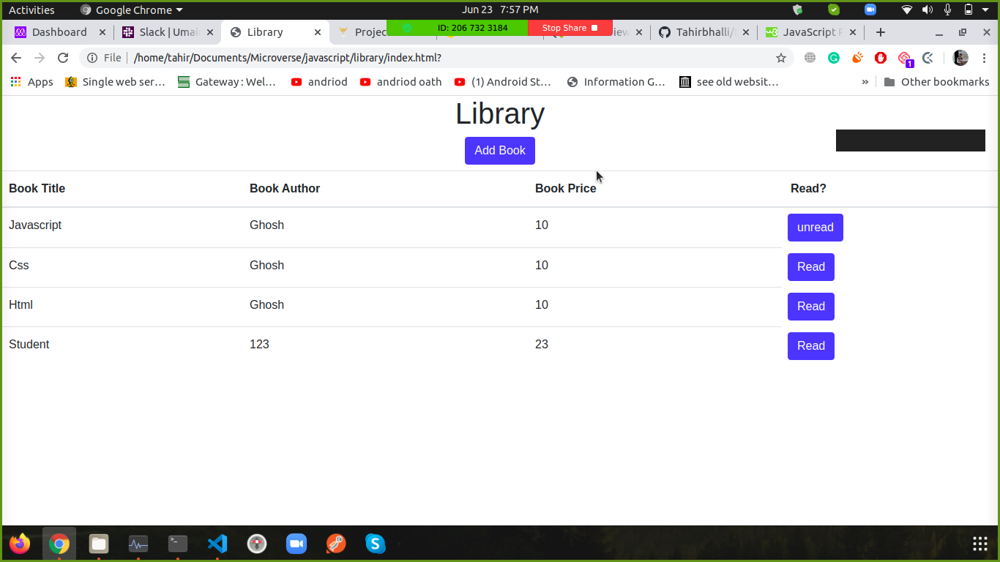

# Library

This is a Simple Javascript project where we dynamically ad books and store in localstorage.

## Built With

- Html
- CSS
- Javascript

## Live Demo

[Live Demo Link](https://rawcdn.githack.com/Tahirbhalli/library/8c9911fcae9f35903e57a8a823efb23e818eb752/index.html)

## Authors

👤 **Author1**

- Github: [@tirthajyoti-ghosh](https://github.com/tirthajyoti-ghosh)

👤 **Author2**

- Github: [@tahirbhalli](https://github.com/tahirbhalli/)

## 🤝 Contributing

Contributions, issues and feature requests are welcome! Start by:
* Forking the project
* Cloning the project to your local machine
* `cd` into the Youtube-Replica project directory
* Run `git checkout -b your-branch-name`
* Make your contributions
* Push your branch up to your forked repository
* Open a Pull Request with a detailed description to the development branch of the original project for a review

## 📝 License

This project is [MIT](https://opensource.org/licenses/MIT) licensed.
